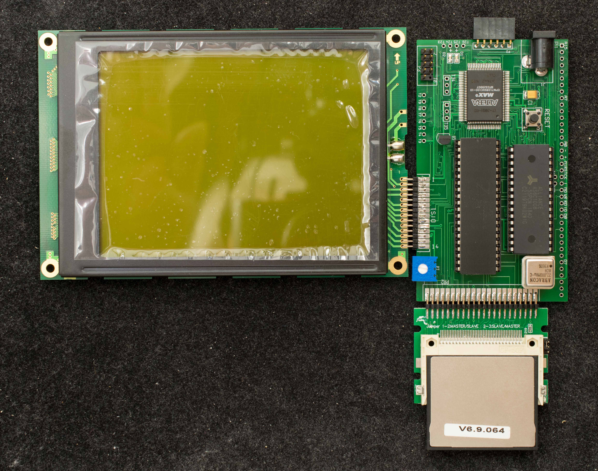

# Z80LCD, Z80 Controller for UG32F01, 320x240 LCD Display Panel
### Introduction
UG32F01 is a monochrome 320×240 LCD display. It does not have a controller on board. Z80LCD is designed specifically as a controller for UG32F01

### Features
- 22MHz Z80
- 128K RAM with 4 banks of 32K
- Compact Flash interface
- Altera EPM7128SQC100 CPLD
- High-speed Serial port, 115200 N-8-1
- RC2014 expansion bus
- LCD interface to UG32F01
- 2-layer pc board, 102mm x 59mm
### Design Information
- Schematic
- Gerber photoplots
- CPLD equations
